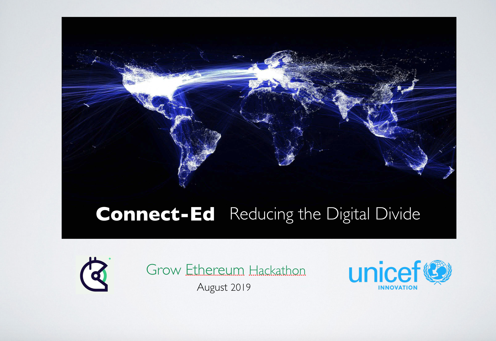
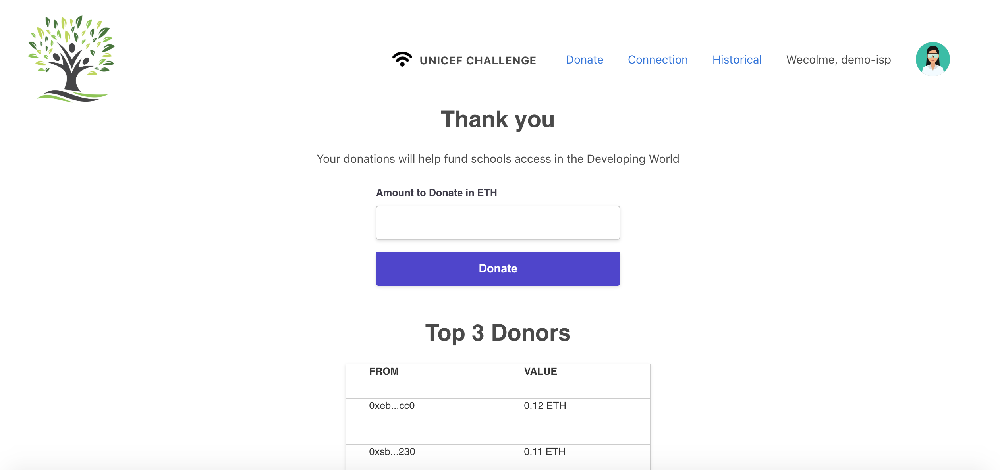
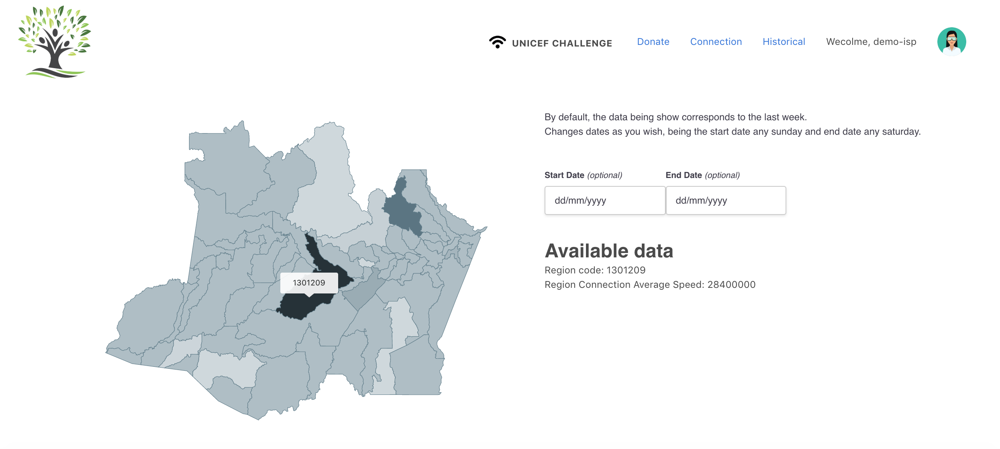
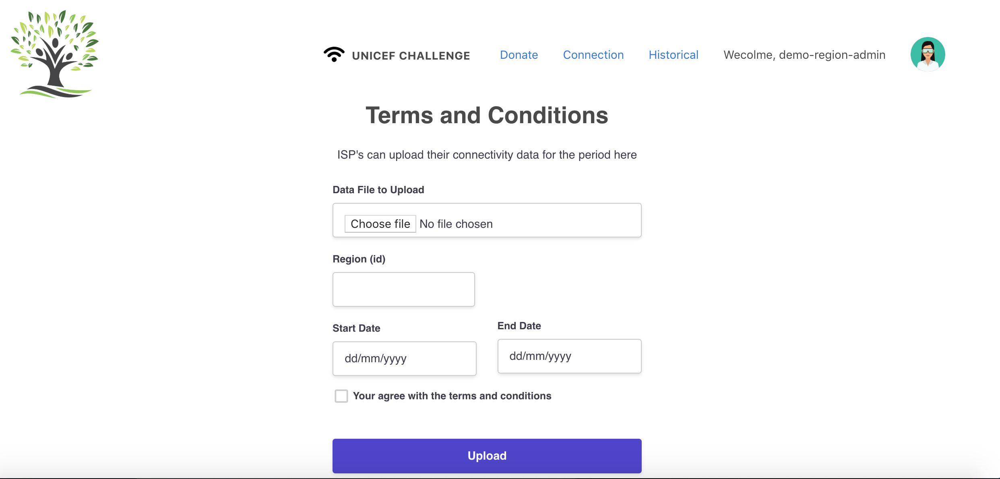

# Connect-Ed

## Built by
* [Thomas Moran](https://www.linkedin.com/in/thomas-moran-8634007/)
* [Bernardo Vieira](https://www.linkedin.com/in/obernardovieira/)

## Usage
Please install all dependencies before doing anything. Use `npm install` or `yarn`

To run it locally, please remove the *contracts* folder in client/src/ folder, as it is there to be used on the live demo.

With Linux or OSX, just run the `local_demo.sh` script at the project root folder.

Please, make sure to have a local ipfs node instance running.

## Overview 

* The user logs in by scanning the QR code from the uPort app on their mobile phone 


* There are several different accounts or views in the App: 

  - The ISP Admin Account.

  - The Region Admin Account

  - The Public View 

  - A Demo Account 
  
* The Accounts Smart Contract contains logic for user account management including: 
  - Allowing a user to sign up with their uport DID
  - Getting a user from the Ethereum blockchain 
  - Checking the user is valid against the address in the uPort DID registry 
  - Allowing the owner to invite other users to have specials roles in the system
  
* The Donations Screen allows anyone to donate to the project in ETH
  - The Donations Smart Contract contains logic for donation management : 
  - Includes functions to receive donations 
  - Allows a region administrator to withdraw an amount of funds to that region. 
  

* The Connections Screen allows anyone to interactively view the current connectivity statistics.
  - The network connectivity history can also be visualised by date
  - There is an admin page which allows the user that deployed the contracts to set up roles within the system 

  
* The ISP Admin Screen allows ISP's to upload connectivity stats for a region for a given time period.

  - The connectivity data uploaded is stored in IPFS as it needs to be publicly available.
  - The file upload format must use a valid region id,  ISP id and region admin. 
  - The ISP smart contract contains functions to get the data files from IPF
  - a function to set the region for an ISP and a function to upload the data files to IPFS 
  

## Pitch Deck
Please check out the full pitch deck attached to the repo 

## Assumptions

### ISP
* ISP will upload valid data, not currepted data, neither fake

### General
* Most imputs have not validation, be sure to write valid data, like in donation window.

## How to run the demo

The easiest way to run the demo is by running the `local_demo.sh` script, but in case you want to run in entirely by hand, here's a quick intro.

First of all, install all dependencies, remove the *contracts* folder in client/src/ folder, then go to *ethereum* folder and start a local ganache network by running `npm run start:ganache:dev` and then, without closing it, run `npm run deploy:ganache`.

Now, go to *client* folder, run `npm run link-contracts` to create a folder link in order to be able to use the contracts from the frontend.

Please make sure to have a ipfs node running locally or copy the .env.production to .env.development

To start the frontend just do it with `npm run start` from the client folder.

## Demo Account View

In case you do not want to sign up, you can see the system by using either ISP or region admin demo accounts.
You can also view a working demo here: https://connect-ed.netlify.com 

## Credits
Thanks to wilawantama for the [favicon](https://www.favicon.cc/?action=icon&file_id=912808)
Thanks to Tahir Khan for the [tree logo](https://pngtree.com/free-vectors)
Thanks to flaticon for the [wifi icon](https://www.flaticon.com/free-icons/wifi)
Thanks to Roundicons for the [avatar](https://www.flaticon.com/authors/roundicons)
